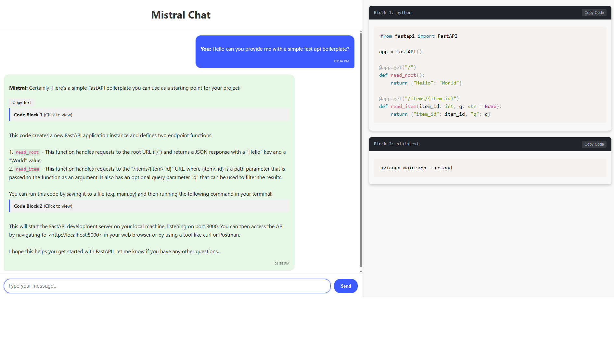

# Mistral Chatbot - CodeMate

Welcome to CodeMate, an intelligent chatbot powered by the Mistral AI model! CodeMate is designed to assist you with coding-related questions, provide explanations, offer suggestions, and even help you understand code snippets.

## Table of Contents

* [Features](#features)
* [Getting Started](#getting-started)
    * [Prerequisites](#prerequisites)
    * [Running the Frontend](#running-the-frontend)
    * [Running the Backend](#running-the-backend)
* [Using the Chatbot](#using-the-chatbot)
    * [Sending Messages](#sending-messages)
    * [Viewing Code Artifacts](#viewing-code-artifacts)
    * [Copying Code](#copying-code)
* [Code Formatting and Highlighting](#code-formatting-and-highlighting)
* [Troubleshooting](#troubleshooting)
* [Contributing](#contributing)
* [License](#license)
* [Acknowledgments](#acknowledgments)

## Features

* **Intelligent Chat:** Powered by the Mistral AI model for insightful and helpful responses to your coding queries.
* **Code Block Detection:** Automatically identifies and extracts code blocks from the AI's responses.
* **Syntax Highlighting:** Displays code blocks with syntax highlighting for improved readability across various programming languages.
* **Code Artifact Panel:** Organizes extracted code blocks in a separate panel for easy access and review.
* **Copy Code Functionality:** Allows you to quickly copy code blocks directly from the artifact panel or the chat.
* **User-Friendly Interface:** A clean and intuitive chat interface for seamless interaction.
* **Markdown Formatting:** Supports basic Markdown formatting in chat messages for better readability.

## Getting Started

To use CodeMate, you need to have both the frontend (user interface) and the backend (API that communicates with the AI) running.

### Prerequisites

* **Node.js and npm (for the frontend):** Ensure you have Node.js and npm (Node Package Manager) installed on your system. You can download them from [https://nodejs.org/](https://nodejs.org/).
* **Python (for the backend):** Python 3.x is required for the backend. You can download it from [https://www.python.org/downloads/](https://www.python.org/downloads/).
* **pip (Python package installer):** pip usually comes bundled with Python.
* **Backend Dependencies:** The backend likely has specific Python libraries it depends on (e.g., FastAPI, Uvicorn, an AI library). These will need to be installed.
* **API Key (if required):** If the Mistral AI model requires an API key, you'll need to obtain one and configure it in the backend.

### Running the Frontend

1.  **Navigate to the frontend directory** in your terminal:
    ```bash
    cd path/to/your/frontend
    ```
    *(Replace `path/to/your/frontend` with the actual path to your frontend folder)*

2.  **Install frontend dependencies:**
    ```bash
    npm install
    ```
    This command installs all the necessary packages listed in the `package.json` file.

3.  **Start the frontend development server:**
    ```bash
    npm run dev
    ```
    or
    ```bash
    npm start
    ```
    *(The exact command might vary depending on your `package.json` scripts)*

4.  **Open in your browser:** Once the development server starts, the frontend will usually be accessible at `http://localhost:<port>` (often `http://localhost:3000` or similar). Check your terminal output for the exact URL.

### Running the Backend

1.  **Navigate to the backend directory** in your terminal:
    ```bash
    cd path/to/your/backend
    ```
    *(Replace `path/to/your/backend` with the actual path to your backend folder)*

2.  **Install backend dependencies:**
    ```bash
    pip install -r requirements.txt
    ```
    *(Assuming you have a `requirements.txt` file listing the dependencies)*

3.  **Run the backend server:**
    ```bash
    python main.py
    ```
    or a similar command depending on your backend framework (e.g., for FastAPI using Uvicorn):
    ```bash
    uvicorn main:app --reload
    ```
    *(Replace `main.py` and `app` if your main application file and app instance have different names)*

4.  **Check the backend URL:** The backend API will typically run on a specific port (e.g., `http://localhost:8000`). Ensure the frontend is configured to communicate with this backend URL.

## Using the Chatbot

Once both the frontend and backend are running, you can start interacting with CodeMate through your web browser.

### Sending Messages

1.  **Type your question or query** in the input field at the bottom of the chat interface.
2.  **Press Enter** or click the **"Send"** button to submit your message.
3.  The chatbot's response will appear in the chat window.

### Viewing Code Artifacts

When CodeMate detects code blocks in its response, they will be:

1.  **Displayed inline** within the chat message with syntax highlighting.
2.  **Extracted and listed in the "Artifact Panel"** (usually located on the side of the chat interface).
3.  Each code artifact in the panel will have a header indicating the detected language (if any) and a number for easy reference.
4.  You can click on a **"Code Block [Number] (Click to view)"** link within the chat message to quickly scroll to the corresponding artifact in the panel.

### Copying Code

You can easily copy code snippets from CodeMate:

1.  **From the Artifact Panel:** Each code artifact in the panel has a **"Copy Code"** button. Click this button to copy the entire code block to your clipboard. A "Copied!" message will briefly appear to confirm the action.
2.  **From the Chat Message:** Each inline code block in the AI's response also has a **"Copy Text"** button. Clicking this will copy the raw text of the AI's message (including the code) to your clipboard.

## Code Formatting and Highlighting

* Code blocks in the AI's responses are automatically detected (usually enclosed in triple backticks \`\`\`).
* If a language is specified after the opening backticks (e.g., \`\`\`python), CodeMate will attempt to highlight the code accordingly. If no language is specified, it will default to plain text highlighting.
* Basic Markdown formatting (e.g., `**bold**`, `*italic*`, ``inline code``) is supported in the chat messages for better readability.

## Troubleshooting

* **Chatbot not responding:** Ensure both your frontend and backend servers are running without any errors. Check your terminal output for any error messages. Verify that the frontend is correctly configured to connect to the backend API URL.
* **Code artifacts not appearing:** If the AI's response contains code but it's not showing up in the artifact panel, check the backend's code extraction logic and the frontend's handling of the API response.
* **Syntax highlighting not working:** Ensure the language is correctly identified in the code block (using backticks with a language hint). Also, verify that the necessary syntax highlighting library (e.g., Prism.js) is correctly integrated into the frontend. Check your browser's developer console for any JavaScript errors related to syntax highlighting.
* **Frontend or backend failing to start:** Carefully review the error messages in your terminal. These usually indicate missing dependencies or configuration issues. Follow the instructions in the error messages to resolve them (e.g., installing missing packages).

## Screenshot


<br>
*A screenshot of the CodeMate chatbot user interface.*

## Contributing

We welcome contributions to CodeMate! If you have suggestions for improvements, bug fixes, or new features, please feel free to:

1.  Fork the repository on GitHub.
2.  Create a new branch with a descriptive name for your changes.
3.  Make your changes and commit them with clear and concise messages.
4.  Push your branch to your forked repository.
5.  Submit a pull request to the main repository.

Please follow any contributing guidelines outlined in the repository.

## License

MIT License
